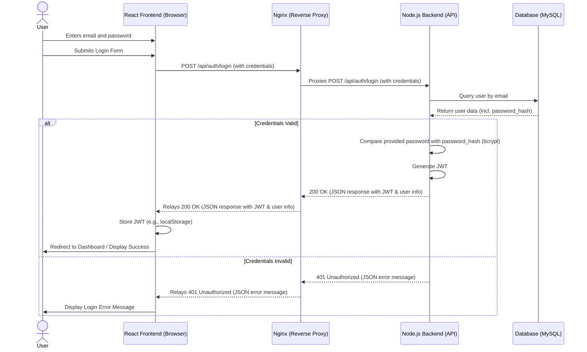

# System Diagrams

## 1. High-Level Architecture Diagram

This diagram illustrates the main components of the AI CV Maker application and their interactions.

```mermaid
graph TD
    A[User (Browser)] -- HTTP Request for Web App --> B(Nginx Reverse Proxy);
    B -- Serves Static Frontend Files (HTML, CSS, JS) --> A;
    A -- Renders React Frontend --> C[React Frontend (in Browser)];
    C -- API Calls (e.g., /api/cvs) --> B;
    B -- Proxies /api requests --> D[Node.js Backend (Express API)];
    D -- Queries/Updates --> E[Database (MySQL)];
    E -- Returns Data --> D;
    D -- API Response --> B;
    B -- Relays API Response --> C;

    subgraph "Client Tier"
        A
        C
    end

    subgraph "Web Tier / Edge"
        B
    end

    subgraph "Application Tier"
        D
    end

    subgraph "Data Tier"
        E
    end
```

## 2. Sequence Diagram for User Login

This diagram details the sequence of interactions during the user login process.


