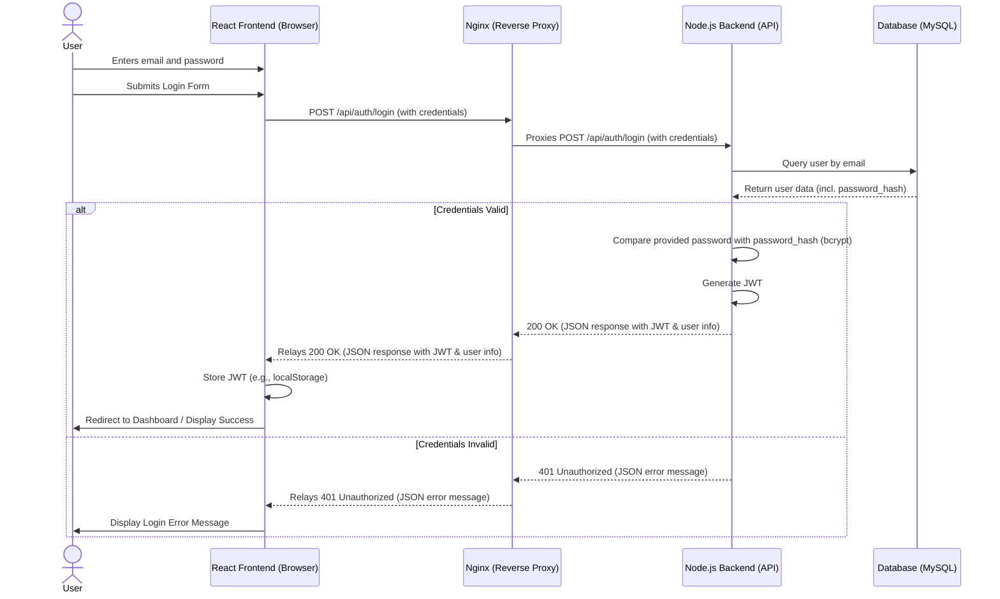

# AI CV Maker - System Architecture Overview

## 1. Introduction

The AI CV Maker (formerly JD2CV) is an intelligent tool designed to help users create, optimize, and tailor their CVs/resumes for specific job descriptions using generative AI. It simplifies the resume writing process by providing AI-powered content generation and suggestions, enabling users to craft compelling and targeted applications.

This document provides a comprehensive overview of the system architecture, including the frontend and backend structures, data flow, build and deployment processes, and key architectural diagrams. Its purpose is to serve as a central reference for understanding how the different parts of the application work together.

## 2. Frontend Structure
# Frontend Structure Documentation

This document outlines the structure and key aspects of the AI CV Maker frontend application.

## 1. Main Technologies Used

The frontend is built using the following main technologies:

- **React 19.1.0:** A JavaScript library for building user interfaces.
- **Vite 6.2.0:** A modern frontend build tool that provides a faster and leaner development experience.
- **TypeScript ~5.7.2:** A superset of JavaScript that adds static typing, improving code quality and maintainability.
- **React Router DOM 7.6.2:** For declarative routing in the React application.
- **@google/genai 1.5.1:** Likely used for interacting with Google's Generative AI services.

## 2. Overview of Key Directories

The `src` directory contains the core of the application, organized as follows:

- **`src/`**: Root source directory.
    - **`App.tsx`**: The main application component, responsible for setting up routing and overall layout.
    - **`index.tsx`**: The entry point of the React application, rendering the `App` component into the DOM.
    - **`index.css`**: Global stylesheets for the application.
    - **`constants.tsx`**: Likely contains application-wide constants.
    - **`types.ts`**: Contains TypeScript type definitions used throughout the project.

- **`src/components/`**: Contains reusable UI components.
    - **`auth/`**: Components related to authentication and authorization.
        - `AdminProtectedRoute.tsx`: A higher-order component to protect routes requiring admin privileges.
        - `ProtectedRoute.tsx`: A higher-order component to protect routes requiring user authentication.
    - **`cv_templates/`**: Components for different CV template styles.
        - `ClassicTemplate.tsx`: A component for rendering a CV in a classic format.
        - `ModernTemplate.tsx`: A component for rendering a CV in a modern format.
    - **`layout/`**: Components defining the overall page structure.
        - `MainFooter.tsx`: The main application footer.
        - `MainHeader.tsx`: The main application header.
    - **`panels/`**: Components for specific UI panels, likely for editing or selection.
        - `ContentEditorPanel.tsx`: A panel for editing CV content.
        - `ThemeSelectorPanel.tsx`: A panel for selecting CV themes.
    - **`shared/`**: Common, smaller UI components used across different parts of the application.
        - `ErrorMessage.tsx`: A component to display error messages.
        - `LoadingSpinner.tsx`: A component to indicate loading states.

- **`src/pages/`**: Contains components that represent different pages/views of the application.
    - `AdminDashboardPage.tsx`: Page for the admin dashboard.
    - `DashboardPage.tsx`: Page for the user's dashboard.
    - `EditorPage.tsx`: Page for the CV editor.
    - `LandingPage.tsx`: The application's landing page.
    - `LoginPage.tsx`: Page for user login.
    - `NotFoundPage.tsx`: Page displayed when a route is not found.
    - `SignupPage.tsx`: Page for user registration.

- **`src/services/`**: Contains modules for interacting with external services or handling business logic.
    - `analyticsService.ts`: Module for tracking page views and other analytics events.
    - `geminiService.ts`: Module for interacting with the Gemini AI service (likely via `@google/genai`).

- **`src/assets/`**: (Not explicitly listed in `ls` output, but a common convention) This directory would typically store static assets like images, fonts, etc.

## 3. Important UI Components and Their Roles

Based on the file structure, key UI components include:

- **`MainHeader.tsx`**: Renders the main navigation and branding at the top of most pages.
- **`MainFooter.tsx`**: Renders the footer content at the bottom of most pages.
- **`CVPreview.tsx`**: (Located in `src/components/`) Likely responsible for displaying a preview of the CV being edited or generated. This component would work in conjunction with template components like `ClassicTemplate.tsx` and `ModernTemplate.tsx`.
- **`ContentEditorPanel.tsx`**: (Located in `src/components/panels/`) Provides the UI for users to input and edit the content of their CV (e.g., personal details, work experience, education).
- **`ThemeSelectorPanel.tsx`**: (Located in `src/components/panels/`) Allows users to choose different themes or templates for their CV.
- **`LoadingSpinner.tsx`**: Used to indicate that data is being fetched or a page/component is loading.
- **`ErrorMessage.tsx`**: Used to display user-friendly error messages.
- Template Components (`ClassicTemplate.tsx`, `ModernTemplate.tsx`): Responsible for the visual presentation of the CV data in different styles.

## 4. Routing Setup

Routing is managed by `react-router-dom` as configured in `src/App.tsx`:

- **`BrowserRouter`**: Wraps the application to enable HTML5 history API-based routing.
- **`Routes` and `Route`**: Define the different navigation paths and the components they render.
- **Lazy Loading**: Pages are lazy-loaded using `React.lazy()` and `Suspense` to improve initial load time. A `LoadingSpinner` is shown as a fallback during loading.
- **`AppLayout` Component**: A layout component that includes `MainHeader`, `MainFooter`, and an `Outlet` for rendering nested route components. This provides a consistent structure for most pages.
- **Protected Routes**:
    - `ProtectedRoute.tsx`: Ensures that certain routes (e.g., `/editor`, `/dashboard`) are only accessible to authenticated users.
    - `AdminProtectedRoute.tsx`: Ensures that routes like `/admin` are only accessible to users with admin privileges.
- **Specific Routes**:
    - `/`: `LandingPage`
    - `/editor`: `EditorPage` (protected)
    - `/editor/:cvId`: `EditorPage` for editing an existing CV (protected)
    - `/dashboard`: `DashboardPage` (protected)
    - `/admin`: `AdminDashboardPage` (admin protected)
    - `/login`: `LoginPage` (rendered outside `AppLayout` for a full-screen experience)
    - `/signup`: `SignupPage` (rendered outside `AppLayout` for a full-screen experience)
    - `*`: `NotFoundPage` for any unmatched routes.
- **Analytics**: An `AnalyticsPageViewTracker` component uses `useEffect` and `useLocation` to track page views via `analyticsService.ts`.

## 5. State Management

- The provided files do **not** explicitly show the use of a global state management library like Redux or Zustand.
- `src/App.tsx` mentions: "// Auth context/state would typically be managed here or in a dedicated provider". This suggests that authentication state might be managed using React Context or is planned to be.
- Component-level state (using `useState`, `useReducer`) is likely used within individual components as needed.
- Data fetching and service interactions are handled in the `src/services/` directory, which might involve local state management within components that use these services.

## 6. Build Process

The build process is defined by Vite and configured in `vite.config.ts` and `package.json`:

- **`package.json` scripts**:
    - `dev`: Runs the Vite development server (`vite`).
    - `build`: Creates a production build of the application (`vite build`).
    - `preview`: Serves the production build locally for previewing (`vite preview`).
- **`vite.config.ts`**:
    - **Environment Variables**: Uses `loadEnv` to load environment variables. Specifically, `GEMINI_API_KEY` is made available in the frontend code as `process.env.API_KEY` and `process.env.GEMINI_API_KEY`.
    - **Aliases**: Configures an alias `@` to point to the root directory (`.`) for easier imports (`resolve: { alias: { '@': path.resolve(__dirname, '.') } }`).
    - **Module Type**: `package.json` specifies `"type": "module"`, indicating the project uses ES modules.
    - **Output**: Vite bundles the code into static assets (HTML, CSS, JavaScript) suitable for deployment. The default output directory for `vite build` is usually `dist/`.

This structure indicates a well-organized, modern React application leveraging TypeScript for type safety and Vite for an efficient development and build process.

## 3. Backend Structure
# Backend Structure Documentation

This document outlines the structure and key aspects of the AI CV Maker backend application.

## 1. Main Technologies Used

The backend is built using the following main technologies:

- **Node.js:** A JavaScript runtime environment for executing server-side code.
- **Express 5.1.0:** A minimalist and flexible Node.js web application framework used for building the API.
- **TypeScript 5.8.3:** A superset of JavaScript that adds static typing, improving code quality and maintainability. The code is compiled to JavaScript (evident from `scripts.build: "tsc"` in `package.json`).
- **MySQL (via `mysql2` 3.14.1):** A relational database used for data persistence.
- **JSON Web Tokens (JWT) (via `jsonwebtoken` 9.0.2):** Used for stateless authentication.
- **bcrypt 6.0.0:** A library for hashing passwords before storing them in the database.
- **dotenv 16.5.0:** Used for managing environment variables.
- **cors 2.8.5:** Middleware to enable Cross-Origin Resource Sharing.

## 2. Key Directories and Files

The `backend/src` directory contains the core of the application:

- **`backend/src/`**: Root source directory.
    - **`server.ts`**: The main entry point of the backend application. It initializes the Express server, sets up middleware (CORS, JSON parsing), registers API routes, and starts listening for requests. It also includes basic error handling middleware.
    - **`db.ts`**: Configures and exports the MySQL database connection pool using `mysql2/promise`. It reads database credentials from environment variables.
    - **`config.ts`**: Exports configuration values, primarily the `JWT_SECRET` read from environment variables, with a fallback.
    - **`database_schema.sql`**: Contains the SQL DDL statements to create the database (`cv_builder_db`) and its tables (`users`, `cv_templates`, `cvs`). It also includes seed data for `cv_templates`.

- **`backend/src/routes/`**: Contains modules that define the API routes.
    - **`auth/authRoutes.ts`**: Defines routes for user authentication, specifically registration (`/register`) and login (`/login`).
    - **`cvs/cvRoutes.ts`**: Defines CRUD (Create, Read, Update, Delete) routes for managing CVs. These routes are protected, meaning they require authentication.
    - **`cvs/cvTemplateRoutes.ts`**: Defines routes for fetching CV templates. Currently, it allows fetching all templates.
    - **`users/userRoutes.ts`**: Defines routes for user profile management (get and update current user's profile). These routes are protected.

- **`backend/src/middleware/`**: Contains custom middleware functions.
    - **`authMiddleware.ts`**:
        - `protect`: Verifies JWT tokens from the `Authorization` header to protect routes. It attaches user information to the request object (`req.user`).
        - `admin`: Checks if the authenticated user has admin privileges. This is used to protect admin-specific routes.

## 3. API Endpoint Structure and Examples

The API routes are prefixed with `/api` as defined in `server.ts`.

- **Authentication (`/api/auth`)**:
    - `POST /api/auth/register`: Creates a new user. Expects `username`, `email`, and `password` in the request body. Returns a JWT and user information.
    - `POST /api/auth/login`: Logs in an existing user. Expects `email` and `password`. Returns a JWT and user information.

- **Users (`/api/users`)**:
    - `GET /api/users/me`: Fetches the profile of the currently authenticated user. Protected by `protect` middleware.
    - `PUT /api/users/me`: Updates the profile (username, email, password) of the currently authenticated user. Protected by `protect` middleware.

- **CVs (`/api/cvs`)**: All routes are protected by `protect` middleware.
    - `POST /api/cvs`: Creates a new CV. Expects `cv_data` (JSON), `template_id` (optional), and `name` (optional).
    - `GET /api/cvs`: Retrieves all CVs for the authenticated user.
    - `GET /api/cvs/:id`: Retrieves a specific CV by its ID, belonging to the authenticated user.
    - `PUT /api/cvs/:id`: Updates a specific CV by its ID. Expects `cv_data`, `template_id`, or `name`.
    - `DELETE /api/cvs/:id`: Deletes a specific CV by its ID.

- **CV Templates (`/api/cv-templates`)**:
    - `GET /api/cv-templates`: Retrieves a list of all available CV templates. This route is public.

## 4. Authentication Mechanism

- Authentication is handled using **JSON Web Tokens (JWT)**.
- When a user logs in or registers, the server generates a JWT signed with the `JWT_SECRET` (from `config.ts`). This token typically includes `userId`, `username`, and `isAdmin` status in its payload and has an expiration time (e.g., '1h').
- The client is expected to send this JWT in the `Authorization` header with the `Bearer` scheme for requests to protected routes.
- The **`protect` middleware** (`backend/src/middleware/authMiddleware.ts`) intercepts requests to protected routes:
    - It extracts the token from the `Authorization: Bearer <token>` header.
    - It verifies the token using `jwt.verify()` and the `JWT_SECRET`.
    - If the token is valid, it decodes the payload and attaches user information (e.g., `userId`, `username`, `isAdmin`) to the `req.user` object. The request then proceeds to the route handler.
    - If the token is missing, invalid, or expired, it sends a `401 Unauthorized` response.
- The **`admin` middleware** can be used in conjunction with `protect` to further restrict access to routes that require administrative privileges by checking the `req.user.isAdmin` flag.

## 5. Database Interaction

- The application uses a **MySQL** database.
- Database connection is managed by `backend/src/db.ts`, which sets up a connection pool using the `mysql2/promise` library. Connection parameters (host, user, password, database name) are loaded from environment variables.
- The database schema is defined in `backend/src/database_schema.sql`. It includes tables:
    - **`users`**: Stores user information including `id`, `username`, `email`, `password_hash`, and `is_admin` status.
    - **`cv_templates`**: Stores information about available CV templates like `id`, `name`, `description`, and `preview_image_url`.
    - **`cvs`**: Stores user-created CVs, including `id`, `user_id` (foreign key to `users`), `template_id` (foreign key to `cv_templates`), `cv_data` (stored as JSON), and `name`.
- Route handlers in `backend/src/routes/` interact with the database by executing SQL queries using the connection pool (e.g., `pool.query(...)`).
- Passwords are not stored in plaintext; they are hashed using `bcrypt` before being saved to the `users` table (as seen in `authRoutes.ts`).

## 6. Server Startup

- The server is started by running the `backend/src/server.ts` file (or its compiled JavaScript equivalent in `dist/server.js`).
- `package.json` defines the following scripts:
    - `npm run build`: Compiles TypeScript files from `src` to JavaScript in the `dist` directory using `tsc`.
    - `npm start`: Runs the compiled application using `node dist/server.js`. This is typically used for production.
    - `npm run dev`: Runs the application in development mode using `nodemon src/server.ts`, which automatically restarts the server on file changes.
- The server listens on a port defined by the `PORT` environment variable, defaulting to `3001`.
- Upon starting, it logs a message "Server is running on port [port]" to the console.

This structure represents a typical Node.js Express application with clear separation of concerns for routing, database interaction, configuration, and authentication.

## 4. Data Flow
# Data Flow Documentation

This document describes the data flow within the AI CV Maker application, detailing how the frontend, backend, and Nginx interact for various user operations.

## 1. Overview of Components in Data Flow

- **Frontend (React/TypeScript)**: User interface for interaction. Makes API calls to the backend. Hosted as static files (HTML, CSS, JS) built by Vite.
    - Key Pages: `LoginPage.tsx`, `SignupPage.tsx`, `DashboardPage.tsx`, `EditorPage.tsx`.
    - Key Components: `ProtectedRoute.tsx`, `AdminProtectedRoute.tsx`.
    - Services: Modules in `src/services/` likely encapsulate API call logic (e.g., using `fetch` or `axios`).
- **Backend (Node.js/Express/TypeScript)**: Handles business logic, database interactions, and authentication. Exposes a RESTful API.
    - API Prefix: `/api`.
    - Key Routes: `/api/auth`, `/api/users`, `/api/cvs`.
    - Middleware: `authMiddleware.ts` (`protect`, `admin`) for securing routes.
- **Nginx**: Web server that serves the static frontend assets and acts as a reverse proxy for API requests to the backend.
- **Database (MySQL)**: Stores user data, CVs, and templates.

## 2. Role of Nginx

Nginx plays a critical role in routing requests:

1.  **Serving Frontend**:
    *   When a user accesses the application URL (e.g., `http://localhost:8080` if Nginx is mapped to host port 8080), Nginx receives the request.
    *   For any path that is not `/api/...`, Nginx serves static files (HTML, CSS, JavaScript) from `/usr/share/nginx/html` (the build output of the Vite frontend).
    *   The `try_files $uri $uri/ /index.html;` configuration ensures that for any non-file path (typical for SPA routing), `index.html` is served, allowing React Router to handle frontend navigation.

2.  **Proxying API Requests**:
    *   Any request from the frontend to a path starting with `/api` (e.g., `/api/auth/login`, `/api/cvs`) is intercepted by Nginx.
    *   The `location /api { ... }` block in `nginx.conf` proxies these requests to the backend server, configured as `proxy_pass http://host.docker.internal:3001;`. This means Nginx forwards the request to the backend application listening on port 3001 (likely running on the host machine when Nginx is in a Docker container, or another linked container).
    *   Nginx also sets important headers like `X-Real-IP` and `X-Forwarded-For`.

This setup allows the frontend and backend to be developed and deployed somewhat independently, with Nginx managing how they are exposed to the end-user and how they communicate.

## 3. User Registration and Login Flow

1.  **User Interaction (Frontend)**:
    *   **Registration**: The user fills out the registration form in `src/pages/SignupPage.tsx` (fields: username, email, password).
    *   **Login**: The user fills out the login form in `src/pages/LoginPage.tsx` (fields: email, password).

2.  **API Request (Frontend to Nginx to Backend)**:
    *   On form submission, the frontend (likely via a service function) makes a `POST` request:
        *   Registration: `POST /api/auth/register` with username, email, and password in the request body.
        *   Login: `POST /api/auth/login` with email and password in the request body.
    *   Nginx receives this request and proxies it to the backend's `/api/auth/register` or `/api/auth/login` endpoint.

3.  **Processing (Backend)**:
    *   **Registration**:
        *   The backend's `authRoutes.ts` receives the request.
        *   It validates the input.
        *   It checks if the user already exists in the `users` table (MySQL).
        *   It hashes the password using `bcrypt`.
        *   It inserts the new user into the `users` table.
        *   It generates a JWT (JSON Web Token) containing user details (e.g., `userId`, `username`, `isAdmin`).
    *   **Login**:
        *   The backend's `authRoutes.ts` receives the request.
        *   It validates the input.
        *   It finds the user by email in the `users` table.
        *   It compares the provided password with the stored `password_hash` using `bcrypt.compare()`.
        *   If credentials are valid, it generates a JWT.

4.  **API Response (Backend to Nginx to Frontend)**:
    *   The backend sends a JSON response:
        *   Success: Typically a `200 OK` (login) or `201 Created` (registration) status, containing the JWT and some user information.
        *   Error: An appropriate HTTP error status (e.g., `400 Bad Request`, `401 Unauthorized`, `409 Conflict`).
    *   Nginx relays this response back to the frontend.

5.  **Token Handling (Frontend)**:
    *   On successful login/registration, the frontend receives the JWT.
    *   It will typically store this token in `localStorage` or `sessionStorage` to persist the user's session.
    *   It will then likely redirect the user to a protected page (e.g., `/dashboard`).

## 4. CV Creation, Retrieval, Update, and Deletion (CRUD) Operations

These operations typically occur in `src/pages/EditorPage.tsx` (for creating/editing individual CVs) and `src/pages/DashboardPage.tsx` (for listing and managing CVs).

1.  **User Interaction (Frontend)**:
    *   **Create**: User clicks a "Create New CV" button, potentially chooses a template (`ThemeSelectorPanel.tsx`), and inputs data into `ContentEditorPanel.tsx`.
    *   **Read (List)**: User navigates to `DashboardPage.tsx` to see a list of their CVs.
    *   **Read (Single)**: User clicks on a specific CV in the dashboard to open it in `EditorPage.tsx`.
    *   **Update**: User modifies CV data in `EditorPage.tsx` using `ContentEditorPanel.tsx` and saves changes.
    *   **Delete**: User clicks a "Delete CV" button, likely on the `DashboardPage.tsx` or `EditorPage.tsx`.

2.  **API Request (Frontend to Nginx to Backend)**:
    *   The frontend makes an API call (e.g., using service functions). **Crucially, for these protected routes, the JWT stored earlier must be included in the `Authorization` header as a Bearer token.**
        *   `POST /api/cvs`: (Create) Sends CV data (JSON), `template_id` (optional), `name` (optional).
        *   `GET /api/cvs`: (Read List) Fetches all CVs for the authenticated user.
        *   `GET /api/cvs/:id`: (Read Single) Fetches a specific CV by its ID.
        *   `PUT /api/cvs/:id`: (Update) Sends updated CV data (JSON), `template_id`, or `name`.
        *   `DELETE /api/cvs/:id`: (Delete) Deletes a specific CV.
    *   Nginx proxies these requests to the backend's `/api/cvs` routes.

3.  **Processing (Backend)**:
    *   The backend's `cvRoutes.ts` handles these requests.
    *   **Authentication Check**: The `protect` middleware (`authMiddleware.ts`) runs first. It verifies the JWT from the `Authorization` header. If the token is missing, invalid, or expired, it returns a `401 Unauthorized` error, and the request does not proceed to the route handler. If valid, `req.user` is populated.
    *   **Database Operation**:
        *   Create: Inserts a new record into the `cvs` table, linking to `user_id` from `req.user`. `cv_data` is stored as JSON.
        *   Read (List/Single): Queries the `cvs` table for records matching `user_id` (and `id` for single). Parses `cv_data` from JSON string to object before sending.
        *   Update: Modifies an existing record in the `cvs` table after verifying `user_id`.
        *   Delete: Removes a record from the `cvs` table after verifying `user_id`.

4.  **API Response (Backend to Nginx to Frontend)**:
    *   The backend sends a JSON response (e.g., the created/updated CV, list of CVs, success message, or error message).
    *   Nginx relays this response to the frontend.

5.  **UI Update (Frontend)**:
    *   The frontend updates its state based on the response, re-rendering components to display the new/updated CV, list of CVs, or confirmation messages.

## 5. Protected Routes and Token Usage

-   **Frontend Protection**:
    *   React components like `ProtectedRoute.tsx` and `AdminProtectedRoute.tsx` (defined in `src/components/auth/`) guard frontend routes.
    *   These components typically check if a JWT exists in `localStorage` or `sessionStorage`.
    *   They might also decode the token to check for expiration or roles (like `isAdmin` for `AdminProtectedRoute`).
    *   If the token is missing or invalid (or user doesn't have required role), the user is redirected (e.g., to `/login`).

-   **Backend Protection**:
    *   As described above, the `protect` middleware in `authMiddleware.ts` on the backend secures API endpoints.

-   **Token in API Requests**:
    *   For every API request to a protected backend endpoint, the frontend must retrieve the stored JWT and include it in the `Authorization` header: `Authorization: Bearer <YOUR_JWT>`.
    *   This is how the backend's `protect` middleware can authenticate the user making the request.

This comprehensive data flow ensures secure and efficient communication between the user's browser, the webserver, the application server, and the database, enabling the full functionality of the AI CV Maker.

## 5. Build and Deployment
# Build and Deployment Process

This document describes the build and deployment process for the AI CV Maker application, covering the frontend, backend, and containerization strategy.

## 1. Frontend Build Process

-   **Technology**: The frontend is a React application built using Vite.
-   **Build Script**: The primary build command is defined in the root `package.json`:
    ```json
    "scripts": {
      "build": "vite build"
    }
    ```
    Running `npm run build` executes Vite, which bundles the React application (TypeScript, JSX, CSS, assets) into static HTML, JavaScript, and CSS files.
-   **Output Directory**: Vite places the build output into the `/app/dist` directory (within the build environment, as specified in the `Dockerfile`).
-   **Environment Variables during Build**:
    -   The `vite.config.ts` file is configured to load environment variables. Specifically, it looks for `GEMINI_API_KEY`.
    -   In the `Dockerfile`, `ARG GEMINI_API_KEY` declares a build-time argument, and `ENV VITE_GEMINI_API_KEY=$GEMINI_API_KEY` makes this argument available as an environment variable within the build stage.
    -   `vite.config.ts` then uses `loadEnv` to read `VITE_GEMINI_API_KEY` (which corresponds to the `GEMINI_API_KEY` passed during `docker build`) and defines `process.env.API_KEY` and `process.env.GEMINI_API_KEY` for the frontend code. This means the `GEMINI_API_KEY` is embedded into the static frontend files during the build process.

## 2. Backend Build and Run Process

-   **Technology**: The backend is a Node.js application written in TypeScript using the Express framework.
-   **Build Script**: The `backend/package.json` defines a build script:
    ```json
    "scripts": {
      "build": "tsc"
    }
    ```
    Running `npm run build` (within the `backend` directory) invokes the TypeScript compiler (`tsc`), which compiles the TypeScript source files (from `backend/src`) into JavaScript files, outputting them to the `backend/dist` directory.
-   **Run Scripts**:
    -   **Production (`npm start`)**:
        ```json
        "scripts": {
          "start": "node dist/server.js"
        }
        ```
        This command runs the compiled JavaScript application from the `dist` directory using Node.js. This is intended for production use after a build.
    -   **Development (`npm run dev`)**:
        ```json
        "scripts": {
          "dev": "nodemon src/server.ts"
        }
        ```
        This command uses `nodemon` to run the TypeScript application directly (via `ts-node`, which `nodemon` typically integrates with for `.ts` files, or a similar mechanism). `nodemon` watches for file changes and automatically restarts the server, which is suitable for development.
-   **Environment Variables at Runtime**:
    -   The backend relies on environment variables for configuration (e.g., `DB_HOST`, `DB_USER`, `DB_PASSWORD`, `DB_NAME`, `JWT_SECRET`, `PORT`), as seen in `backend/src/db.ts` and `backend/src/config.ts`.
    -   These variables are typically provided to the backend process when it's started (e.g., via a `.env` file loaded by `dotenv`, or set directly in the deployment environment). The `Dockerfile` provided does not containerize the backend, so its runtime environment variable management is separate from the frontend's container.

## 3. Containerization (Frontend)

The project uses Docker to containerize the frontend application for deployment. This is defined in the `Dockerfile`:

-   **Multi-Stage Build**: The `Dockerfile` employs a multi-stage build to create a lean and optimized final image.

    -   **Stage 1: `build` (Node.js Environment)**
        1.  **Base Image**: `FROM node:18-alpine` provides a Node.js environment.
        2.  **Working Directory**: `WORKDIR /app` sets the context.
        3.  **Dependencies**: `COPY package*.json ./` and `RUN npm install` install frontend dependencies.
        4.  **Source Code**: `COPY src ./src`, `COPY vite.config.ts .`, etc., copy the necessary source files and configurations into the image.
        5.  **Build-time Argument for API Key**:
            ```dockerfile
            ARG GEMINI_API_KEY
            ENV VITE_GEMINI_API_KEY=$GEMINI_API_KEY
            ```
            This allows passing the `GEMINI_API_KEY` at build time (e.g., `docker build --build-arg GEMINI_API_KEY=your_api_key ...`). Vite then uses `VITE_GEMINI_API_KEY` to embed the key into the static files.
        6.  **Build Execution**: `RUN npm run build` compiles the React application, with the output going to `/app/dist`.

    -   **Stage 2: Nginx Server (Production Server)**
        1.  **Base Image**: `FROM nginx:stable-alpine` provides a lightweight Nginx server.
        2.  **Copy Build Artifacts**: `COPY --from=build /app/dist /usr/share/nginx/html` copies only the static build output from the `build` stage into Nginx's default web root directory.
        3.  **Nginx Configuration**: `COPY nginx.conf /etc/nginx/conf.d/default.conf` replaces the default Nginx configuration with the project-specific `nginx.conf`.
        4.  **Expose Port**: `EXPOSE 80` declares that the container listens on port 80.
        5.  **Run Nginx**: `CMD ["nginx", "-g", "daemon off;"]` starts the Nginx server in the foreground.

-   **Deployment**: The resulting Docker image contains the built frontend static assets served by Nginx. This image can then be deployed to any container hosting platform (e.g., Docker Hub, AWS ECS, Kubernetes).
    Example Docker build command:
    `docker build -t ai-cv-maker-frontend --build-arg GEMINI_API_KEY="your_actual_api_key" .`
    Example Docker run command:
    `docker run -d -p 8080:80 ai-cv-maker-frontend` (maps host port 8080 to container port 80)

## 4. Nginx Configuration in Docker

The `nginx.conf` file, copied into the Docker image, configures Nginx to:

1.  **Serve Static Frontend Assets**:
    -   `root /usr/share/nginx/html;` sets the document root to where the frontend's `dist` contents were copied.
    -   `index index.html index.htm;` defines default files.
    -   `location / { try_files $uri $uri/ /index.html; }` is crucial for Single Page Applications (SPAs) like React. It ensures that any requests that don't match a static file are redirected to `index.html`, allowing React Router to handle client-side routing.

2.  **Proxy API Requests**:
    -   `location /api { ... }` defines a block for handling API requests.
    -   `proxy_pass http://host.docker.internal:3001;` (for Docker Desktop on Mac/Windows) or a similar address for Linux (e.g., gateway IP or a service name if backend is also containerized on the same network) forwards any request starting with `/api/` to the backend server listening on port 3001.
    -   This means the Nginx container (running the frontend) communicates with the backend service, which might be running directly on the host machine during development or as another container in a production setup (e.g., in a Docker Compose or Kubernetes environment). The current `Dockerfile` only containerizes the frontend.

## 5. Environment Variable Handling Summary

-   **Frontend (Build-time)**:
    -   `GEMINI_API_KEY`: Passed as a build argument (`--build-arg`) during `docker build`.
    -   `VITE_GEMINI_API_KEY`: Set as an environment variable within the Docker build stage, making it accessible to Vite.
    -   Vite (`vite.config.ts`) embeds this key into the static JavaScript files as `process.env.API_KEY` and `process.env.GEMINI_API_KEY`. This means the key is fixed at build time for the frontend.
-   **Backend (Runtime)**:
    -   The backend (`server.ts`, `db.ts`, `config.ts`) expects various environment variables at runtime (e.g., `DB_HOST`, `DB_USER`, `JWT_SECRET`, `PORT`, `GEMINI_API_KEY` if used directly by backend).
    -   These are not managed by the provided `Dockerfile` but would be set in the environment where the backend Node.js process is run (e.g., host machine's environment, Docker container environment variables if the backend were containerized, CI/CD pipeline variables, or platform-specific configuration like Heroku config vars or Kubernetes secrets/configmaps).

This setup provides a clear process for building the frontend into a static bundle and deploying it within a Docker container using Nginx, while the backend is built and run separately, with Nginx proxying API calls to it.

## 6. System Diagrams

### 6.1. High-Level Architecture
```mermaid
graph TD
    A[User (Browser)] -- HTTP Request for Web App --> B(Nginx Reverse Proxy);
    B -- Serves Static Frontend Files (HTML, CSS, JS) --> A;
    A -- Renders React Frontend --> C[React Frontend (in Browser)];
    C -- API Calls (e.g., /api/cvs) --> B;
    B -- Proxies /api requests --> D[Node.js Backend (Express API)];
    D -- Queries/Updates --> E[Database (MySQL)];
    E -- Returns Data --> D;
    D -- API Response --> B;
    B -- Relays API Response --> C;

    subgraph "Client Tier"
        A
        C
    end

    subgraph "Web Tier / Edge"
        B
    end

    subgraph "Application Tier"
        D
    end

    subgraph "Data Tier"
        E
    end
```

### 6.2. User Login Sequence Diagram


## 7. Project Structure (File Tree)

This project is organized into a monorepo structure with the frontend and backend code in separate directories.

-   **`/` (Root Directory)**: Contains the frontend application code and project-wide configuration.
    -   `src/`: Core frontend application source files (React components, pages, services, assets).
        -   `components/`: Reusable UI components.
        -   `pages/`: Top-level page components.
        -   `services/`: Modules for API communication and other services.
    -   `public/`: Static assets directly served by Vite during development and copied to build output.
    -   `index.html`: The main HTML entry point for the frontend SPA.
    -   `vite.config.ts`: Vite build tool configuration.
    -   `package.json`: Frontend dependencies and scripts (e.g., `dev`, `build`).
    -   `Dockerfile`: Defines the Docker image for building and deploying the frontend with Nginx.
    -   `nginx.conf`: Nginx configuration file used in the Docker image.
    -   `tsconfig.json`: TypeScript configuration for the frontend.
-   **`backend/`**: Contains the backend application code.
    -   `src/`: Core backend application source files (Express server, routes, middleware, database logic).
        -   `routes/`: API route definitions.
        -   `middleware/`: Custom middleware (e.g., authentication).
        -   `database_schema.sql`: SQL script for creating database tables.
        -   `db.ts`: Database connection setup.
        -   `server.ts`: Express server initialization and main application logic.
    -   `package.json`: Backend dependencies and scripts (e.g., `dev`, `build`, `start`).
    -   `tsconfig.json`: TypeScript configuration for the backend.
-   **Documentation Files (Generated)**:
    -   `FRONTEND_STRUCTURE.md`: Detailed frontend architecture.
    -   `BACKEND_STRUCTURE.md`: Detailed backend architecture.
    -   `DATA_FLOW.md`: Description of data flows within the system.
    -   `BUILD_DEPLOYMENT.md`: Overview of build and deployment processes.
    -   `DIAGRAMS.md`: Source for Mermaid diagrams.

This structure separates concerns between the frontend and backend while allowing for unified project management and documentation.
The original `README.md` also contained sections on `Development Setup and Running Locally`, `Key Features`, `Technologies Used`, and `Running with Docker`. These can be reviewed and integrated if they provide additional useful information not covered by the new architectural documents.
